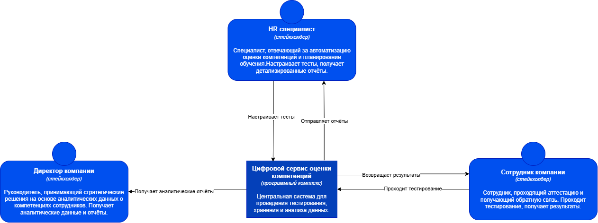
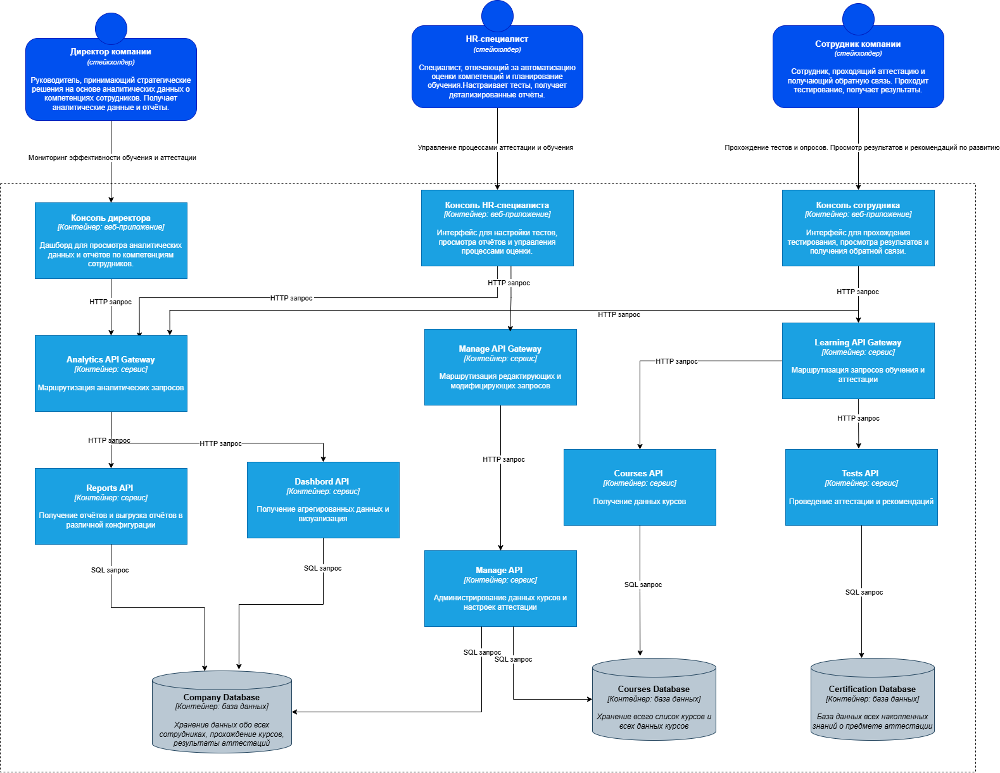

# Architecture — C4 Model Diagrams

Диаграммы C4 из главы «Проектирование» ВКР (Болотов Даниил РИС-22-1).

## Уровень 1 — Системный контекст (C4 Context)

**Рисунок 2 — Диаграмма системного контекста**

Цифровой сервис как центральный программный комплекс, взаимодействующий с тремя акторами:
- **Сотрудник** — проходит тестирование, получает результаты и рекомендации
- **HR-специалист** — настраивает тесты, управляет вопросами, получает отчёты
- **Директор** — получает агрегированные аналитические дашборды

---

## Уровень 2 — Контейнеры (C4 Containers)

**Рисунок 3 — Диаграмма контейнеров**

Структура на уровне контейнеров:

**Фронтенд (React SPA):**
- Консоль сотрудника
- Консоль HR-специалиста
- Консоль директора

**API Gateways (Traefik/Nginx):**
- `Learning API Gateway` — сценарии обучения и аттестации (высокая нагрузка на чтение)
- `Manage API Gateway` — административные операции (высокая частота модифицирующих операций)
- `Analytics API Gateway` — отчёты и дашборды (высокая вычислительная сложность)

**Микросервисы:**
- `Tests API` — проведение тестирования, расчёт результатов, рекомендации
- `Courses API` — управление библиотекой курсов и материалов
- `Manage API` — администрирование контента и настроек
- `Reports API + Dashboard API` — аналитика и визуализация

**Базы данных (Database per Service):**
- `company_db` (PostgreSQL) — мастер-данные сотрудников, результаты аттестаций
- `courses_db` (PostgreSQL) — каталог курсов, материалы, метаданные
- `certification_db` (PostgreSQL) — банк вопросов, логи попыток, результаты тестов
